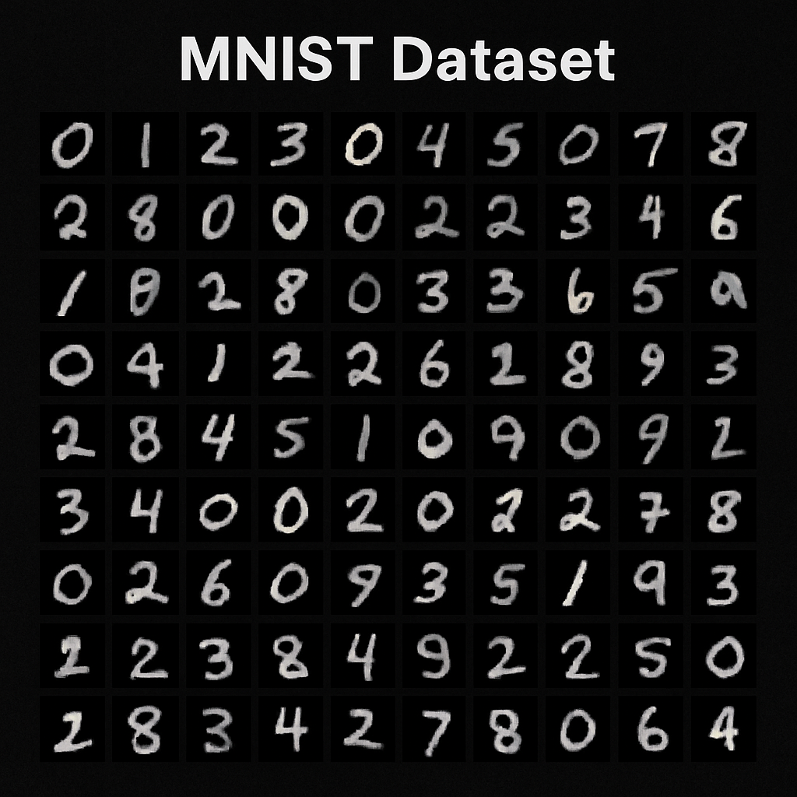

# 🧠 MNIST Digit Classifier (2 vs. Not 2)

This project implements a binary classifier to identify the digit "2" within the MNIST dataset. It utilizes a **Stochastic Gradient Descent (SGD)** classifier and provides a comprehensive evaluation of the model's performance, including learning curves, precision-recall curves, ROC curves, confusion matrices, and classification reports.

	

---

## 📌 Project Overview

The goal of this project is to train a model that can accurately distinguish between the digit **"2"** and all other digits in the MNIST dataset. This is achieved by transforming the multi-class MNIST problem into a **binary classification task**.

	

---

## 📊 Dataset

The MNIST dataset consists of **70,000 grayscale images** of handwritten digits (0–9). The dataset is loaded using `scikit-learn`'s `fetch_openml()` function.

	

---

## 🔧 Dependencies

- `scikit-learn`
- `NumPy`
- `Matplotlib`
- `Seaborn`

---

## ⚙️ Model Training and Evaluation

The script performs the following steps:

1. **Data Loading and Preprocessing:**  
   Loads the MNIST dataset, visualizes a sample digit, splits the data into training/test sets, and creates binary labels (2 vs. not 2).
   
2. **Feature Scaling:**  
   Applies `StandardScaler` to scale the pixel values.

3. **Model Training:**  
   Trains an `SGDClassifier` on the scaled training data.

4. **Model Evaluation:**  
   - Calculates cross-validation accuracy  
   - Evaluates test set accuracy  
   - Plots the learning curve  
   - Computes precision, recall, and F1-score  
   - Plots the precision-recall curve (with AUC)  
   - Plots the ROC curve (with AUC)  
   - Plots the confusion matrix  
   - Displays the classification report

---

## 📈 Results

### 🔄 Learning Curve

The learning curve indicates that the model is performing well, with both training and cross-validation scores converging. A slight gap suggests potential improvement with more data or regularization.

	

---

### 📋 Classification Report

The classification report shows excellent performance, particularly for the **"Not 2"** class. The **"Is 2"** class shows good precision but slightly lower recall, suggesting room for improvement.

	

---

### 🔢 Confusion Matrix

The confusion matrix reveals a **high true negative rate** and a **moderate false negative rate**, consistent with the classification report.

	

---

### 🎯 Precision-Recall Curve

The precision-recall curve shows an **AUC of 0.89**, indicating a strong balance between precision and recall.

	

---

### 📉 ROC Curve

The ROC curve shows an **AUC of 0.97**, demonstrating excellent discrimination ability between the digit "2" and all other digits.

	

---

## ✅ Conclusion

The model demonstrates **strong performance** in identifying the digit **"2"** within the MNIST dataset.  
Further improvements could include:

- Hyperparameter tuning  
- Addressing class imbalance  
- Using ensemble methods  
- Exploring deep learning approaches  

---

